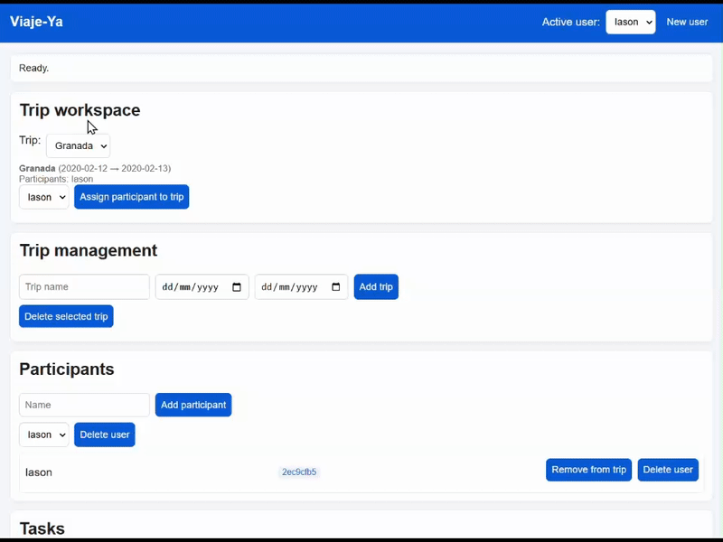

# Milestone 5: Deploying the application on an IaaS or PaaS

## Summary
- Deployed on **Render** (free plan, EU/Frankfurt) using the project’s Docker image and **MongoDB Atlas** (EU/Paris) as the managed database.
- Declarative config in `render.yaml`, auto-deploy from GitHub, and Prometheus metrics exposed at `/metrics`.
- k6 smoke tests against the public URL confirm success (200 OK, ~70–100 ms latency).
- Production UI demo: 

## Provider choice
- **Render** chosen for free plan, direct GitHub + Docker deploy, EU region, and reproducible configuration. Render is a managed PaaS: it abstracts VMs etc., offers deploy hooks, and scales without manual server ops.
- **MongoDB Atlas (EU free plan, Paris)** to avoid running Mongo on the PaaS, keep managed storage, and stay in EU. Atlas is DBaaS; pairing PaaS + DBaaS meets the IaaS/PaaS goal with minimal ops.

## Infrastructure as code / configuration
- [`render.yaml`](../render.yaml): web service (env: docker), region `frankfurt`, plan `free`, healthcheck `/`, env vars `MONGODB_URI` (secret) and `MONGODB_DB=viaje_ya`.
- Docker image: reuse the repo Dockerfile (same artifact as Compose/CI).
- Secret `MONGODB_URI`: Atlas SRV URI with user/pass and `/viaje_ya` suffix for render configuration

## GitHub-driven deployment
- Render Auto-Deploy on branch `main`.
- Optional workflow [`render-deploy.yml`](../.github/workflows/render-deploy.yml) triggers the deploy hook (`RENDER_DEPLOY_HOOK` in GitHub secrets) after each push.
- Live service: [https://viaje-ya.onrender.com](https://viaje-ya.onrender.com)

## Observability
- Prometheus metrics at `/metrics` (via `prometheus-fastapi-instrumentator`), scrapeable by Prometheus/Grafana Cloud.
- Structured JSON logs with `X-Request-ID`; collected by Render/Cloudflare and visible in Render logs.

## Validation
- Manual sanity: `GET /` → 200 JSON, `GET /ui` loads the UI, `GET /metrics` returns Prometheus text.
- Persistence: create participant/trip/task in the UI and reload to confirm Atlas writes.
- k6 smoke: `k6 run scripts/k6-smoke.js -e BASE_URL=https://viaje-ya.onrender.com` → 100% 200 OK, ~75 ms avg latency (5 VUs, 1m):

```
 >> k6 run scripts/k6-smoke.js -e BASE_URL=https://viaje-ya.onrender.com

         /\      Grafana   /‾‾/  
    /\  /  \     |\  __   /  /   
   /  \/    \    | |/ /  /   ‾‾\ 
  /          \   |   (  |  (‾)  |
 / __________ \  |_|\_\  \_____/ 

     execution: local
        script: scripts/k6-smoke.js
        output: -

     scenarios: (100.00%) 1 scenario, 5 max VUs, 1m30s max duration (incl. graceful stop):
              * default: 5 looping VUs for 1m0s (gracefulStop: 30s)


  █ TOTAL RESULTS

    checks_total.......: 280     4.605472/s
    checks_succeeded...: 100.00% 280 out of 280
    checks_failed......: 0.00%   0 out of 280

    ✓ status is 200

    HTTP
    http_req_duration..............: avg=75.42ms min=56.48ms med=69.72ms max=464.39ms p(90)=92.99ms p(95)=101.51ms
      { expected_response:true }...: avg=75.42ms min=56.48ms med=69.72ms max=464.39ms p(90)=92.99ms p(95)=101.51ms
    http_req_failed................: 0.00% 0 out of 280
    http_reqs......................: 280   4.605472/s

    EXECUTION
    iteration_duration.............: avg=1.07s   min=1.05s   med=1.07s   max=1.46s    p(90)=1.09s   p(95)=1.11s
    iterations.....................: 280   4.605472/s
    vus............................: 5     min=5        max=5
    vus_max........................: 5     min=5        max=5

    NETWORK
    data_received..................: 85 kB 1.4 kB/s
    data_sent......................: 19 kB 310 B/s


running (1m00.8s), 0/5 VUs, 280 complete and 0 interrupted iterations
default ✓ [======================================] 5 VUs  1m0s
```

